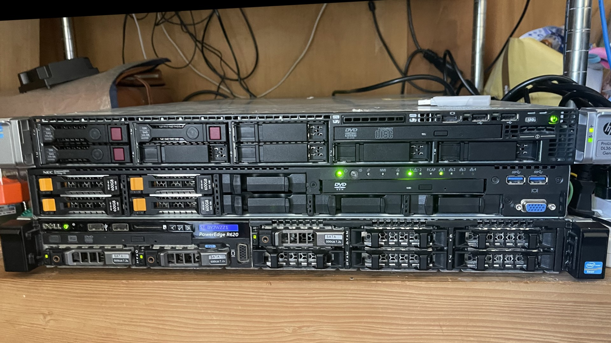

# 🖥️ My Devices & Infrastructure.

このリポジトリは，使用しているワークステーション，サーバー，および関連するインフラストラクチャの構成を管理・文書化するために作成．

  
  
  
  
  
  
  

---

##  workstations ｜ ワークステーション

メインの作業環境です．

### 💻 Main Desktop

| カテゴリ | スペック | 備考 |
| :--- | :--- | :--- |
| **OS** | Windows 11 Pro | `23H2` |
| **CPU** | Intel Core i9-14900KS | 24コア / 32スレッド |
| **GPU** | NVIDIA GeForce RTX 4090 | 24GB GDDR6X |
| **RAM** | 64GB DDR5 (32GB x2) | CORSAIR VENGEANCE @ 5600MHz |
| **Storage (OS)** | 2TB NVMe SSD | Predator SSD |
| **Storage (Data)** | 1TB NVMe SSD | Corsair SSD |
| **Monitor 1** | 27" 144Hz | AOC |
| **Monitor 2** | 24" 75Hz | HP  |
| **Monitor 3** | 18" 60Hz | TOSHIBA  |

### Main Laptop

外出先やミーティングで使用するポータブル環境です．

| カテゴリ | スペック | 備考 |
| :--- | :--- | :--- |
| **Model** | MacBook Pro 14インチ | M4 |
| **OS** | macOS Sequonia | |
| **CPU/GPU** | Apple M4 | 10コアCPU / 16コアGPU |
| **RAM** | 24GB | ユニファイドメモリ |
| **Storage** | 512GB SSD | |

### Sub Laptop

外出先やミーティングで使用するポータブル環境です．

| カテゴリ | スペック | 備考 |
| :--- | :--- | :--- |
| **Model** | ASUS GT531 | Corei7-9750H |
| **OS** | Windows11 Pro | |
| **CPU/GPU** | Corei7-9750H / GTX1650 | 6コアCPU / 4コアGPU |
| **RAM** | 32GB | ユニファイドメモリ |
| **Storage** | 512GB SSD | |

---

## ☁️ Server Infrastructure ｜ サーバー環境

自宅およびクラウドで稼働しているサーバー群です．

### 🏠 Home Lab

自宅及びデータセンターで稼働しているサーバースペックです．

  

| カテゴリ | スペック | 備考 | 
| :--- | :--- | :--- |
| **Model** | HP ProLiant DL360e Gen8 | | 
| **OS** | Ubuntu Desktop 20.04 | |
| **CPU/GPU** | Intel(R) Xeon(R) CPU E5-2470 @2.30GHz| 2294 Mhz(8コア16スレッド)×2 |
| **RAM** | DDR3-1600 rdimm 192GB | ECCメモリ |
| **Storage** | HP SCSI Disk HDD 150GB,SATA HDD1TB×6 | （RAID10）|
| **Node** | Node1 | 自社クラウドの運営|

| カテゴリ | スペック | 備考 | 
| :--- | :--- | :--- |
| **Model** | NEC N8100-2426Y | | 
| **OS** | Ubuntu Desktop 20.04 | |
| **CPU/GPU** | Intel(R) Xeon(R) CPU E5-2620 v4 @2.10GHz| 2101 Mhz(8コア16スレッド) |
| **RAM** | DDR4-2133 rdimm 96GB | ECCメモリ |
| **Storage** | WDC Disk SDD 500GB ||
| **Node** | Node1 | 自社VPSの運用|

| カテゴリ | スペック | 備考 | 
| :--- | :--- | :--- |
| **Model** | DELL PowerEdge R620 | | 
| **OS** | Proxmox VE | |
| **CPU/GPU** | Intel(R) Xeon(R) CPU E5-2667 v2 @3.30GHz| 3300 Mhz(8コア16スレッド)×2 |
| **RAM** | DDR3-1600 rdimm 256GB | ECCメモリ |
| **Storage** | DELL SCSI Disk HDD 500GB×2 ||
| **Node** | Node1 | Proxmoxのクラスタ運用|

| カテゴリ | スペック | 備考 | 
| :--- | :--- | :--- |
| **Model** | NEC Express5800/R120e-2M N8100-2043Y | | 
| **OS** | Ubuntu Server 22.04.3 LTS | |
| **CPU/GPU** | Intel® Xeon® プロセッサー E5-2637 v2| 4コア8スレッド)×2 |
| **RAM** | DDR3-1600  rdimm 128GB | ECCメモリ |
| **Storage** | TOSHIBA SATA HDD 300GB×3 ||
| **Node** | Node2 | 自社クラウドのシステム運用|

| カテゴリ | スペック | 備考 | 
| :--- | :--- | :--- |
| **Model** | DELL OptiPlex 3020 | | 
| **OS** | Proxmox VE | |
| **CPU/GPU** | Intel(R) Xeon(R) CPU E3-1271 v3 @3.60GHz| 3601 Mhz(4コア8スレッド) |
| **RAM** | DDR3-1600 udimm 16GB | |
| **Storage** | ST Disk HDD 500GB ||
| **Node** | Node1 | Proxmoxのクラスタ運用|

| カテゴリ | スペック | 備考 | 
| :--- | :--- | :--- |
| **Model** | FUJITSU PRIMERGY TX1330 M2 | | 
| **OS** | TrueNAS-13.0-U5.3 | |
| **CPU/GPU** | Intel(R) Xeon(R) CPU E3-1220 v5 @3.00GHz| 3201 Mhz(4コア4スレッド)|
| **RAM** | DDR4-2133 udimm 28GB | |
| **Storage** | WD Disk HDD 2TB & 2TB|RAID1|
| **Node** | Node1 | 自社ファイルサーバーの運用|

| カテゴリ | スペック | 備考 | 
| :--- | :--- | :--- |
| **Model** | FUJITSU PRIMERGY TX1320 M1 | | 
| **OS** | Ubuntu Desktop 20.04 | |
| **CPU/GPU** | Intel(R) Core(TM) i5-4570 CPU @ 3.20GHz | 3201 Mhz(4コア4スレッド)|
| **RAM** | DDR3-1600 udimm 16GB | |
| **Storage** | TOSHIBA Disk HDD 500GB ||
| **Node** | Node1 | 自社VPSのパネルシステムのオンプレ運用|

### 🌐 Network

使用しているサーバー用ネットワークです．

| プロバイダ | プラン | 使用ノード |
| :--- | :--- | :--- |
| BIGLOBE | 10Gbps IPoE | Node1 |
| KDDI | 1Gbps IPoE | Node2 |

